# Cat Detection - Yolo_v1 모델 구현을 통한 Animal Detection 

이 문서는 Yolo v1 모델에 대한 소개와 Personal Application, 총 2 파트를 다루고 있습니다.

## Yolo v1 Model
Yolo v1은 논문에서 소개한 2-Stage Detector (DPM, R-CNN) 같이 특징 추출과 객체 분류, 두 가지 과정을 거쳐서 객체를 탐지하는 접근법이 아니라 특징 추출과 객체 분류를 한 번에 처리하는 1-stage Detector 접근법을 취합니다.

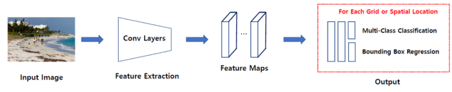
###### 그림 1 - 1-stage Detector의 전체적인 구조 (출처:hoya012.github.io)

위 그림에서 보듯이 특징 추출, 객체 분류 두 문제를 단일 신경망으로 해결합니다.

논문에서는 YOLO가 object detection을 single regression problem으로 재구성했다고 합니다.
> Yolo v1은 single convolutional network로 이미지를 입력받아, 각 박스의 class, 여러 개의 바운딩 박스와 박스의 위치 정보를 예측합니다. 그리고 non-max suppression을 통해 최종 바운딩박스를 선정합니다. 

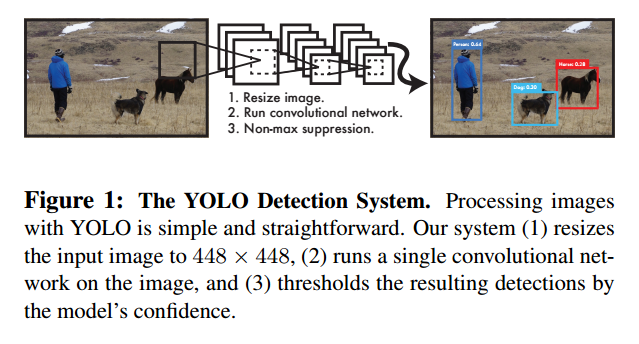
###### 그림 2 - 논문에 나와있는 YOLO system

두 문제를 한꺼번에 처리를 하여 속도는 빠르지만 정확도는 떨어진다고 논문에서 말하고 있습니다. 이처럼 속도와 정확도의 상충 관계(trade off)가 발생합니다.

## 장점
1. 매우 빠릅니다.  
    - [x] 초당 45프레임을 처리할 수 있고, fast version에서는 초당 150프레임을 처리할 수 있습니다.
    - [x] 복잡한 pipeline이 필요하지 않고 이미지에 neural netwrok를 실행하기만 하면 됩니다.
    - [x] 추가적으로 YOLO는 실시간 객체 탐지 방법보다 2배 이상의 mAP(mean average precision)을 얻었다고 논문에서 말하고 있습니다.

2. 객체의 일반화된 representations를 학습하여 다르 도메인에서 좋은 성능을 보입니다.
    - [x] 새로운 이미지나 새로운 도메인에 적용할 때, DPM, R-CNN 같은 detection 방법을 크게 능가합니다.
    - [x] 자연 이미지(natural image)로 학습한 후 그림(artwork)에서 test를 진행해도 다른 모델들 보다 좋은 성능을 보인다고 논문에서는 말하고 있습니다.
    
 
 ###### 그림 3 - 논문에 소개된 Artwork Images

3. Fast R-CNN 보다 background error가 두 배이상 적습니다.
    - [x] YOLO는 예측할 때, 이미지 전체를 이용하기 때문에 class와 객체 출현에 대한 contextual information까지 이용할 수 있습니다.
    - [x] 반면에 Fast R-CNN은 selective search가 제안한 영역만을 이용하여 예측하기 때문에 larger context를 이용하지 못합니다.따라서 R-CNN은 배경을 객체로 탐지하는 실수를 하게 됩니다.

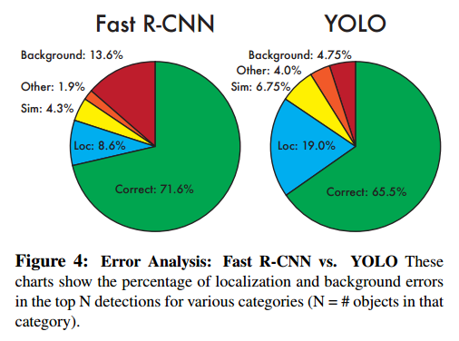
 ###### 그림 4 - Error Analysis between Fast R-CNN and YOLO_v1

## Bounding Box 예측 방식

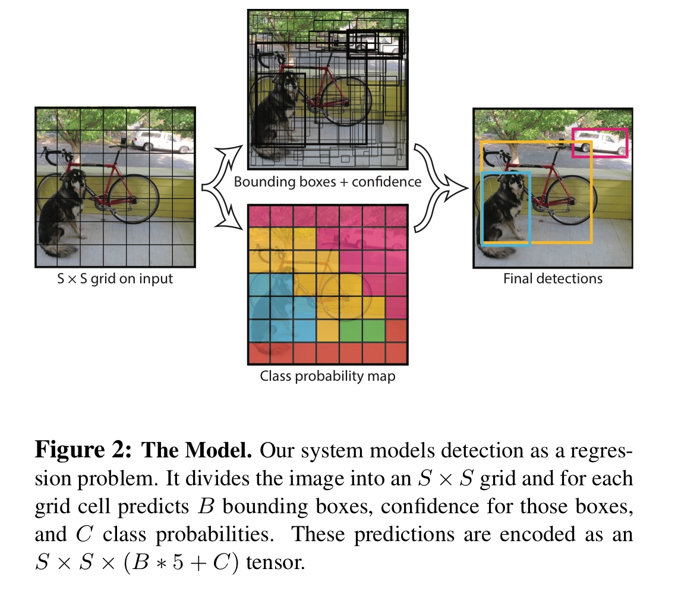{: width="60%" height="60%"}
 ###### 그림 5 - Yolo_v1 Model Explanation

YOLO는 object detection의 개별 요소를 하나의 network로 통했습니다. 어떠한 방식으로 작동하는지 알아보도록 하겠습니다.

1. 입력 이미지를 S x S grid로 분할합니다.

2. 객체의 중심이 grid cell에 맞아 떨어지면 그 grid cell은 객체를 탐지했다고 표기합니다.

3. 각 grid cell은 B개의 바운딩박스와 각 바운딩박스에 대한 confidence score를 예측합니다.
    > confidence score는 얼마나 자신있게 박스가 객체를 포함하고 있는지, 얼마나 정확하게 예측했는지를 반영합니다. confidence는 Pr(Object) * IoU로 계산합니다. cell에 객체가 존재하지 않을 시에 Pr(Object)는 0이 되어 confidence score는 0이 됩니다. 객체가 존재하면 Pr(Object)는 1이 되고 IoU와 곱해져 confidence는 IoU가 됩니다.

4. 각 바운딩 박스는 5개의 정보를 갖고 있습니다. x, y, w, h와 confidence 입니다. x,y는 바운딩박스의 중심을 나타내며 grid cell의 경계에 상대적인 값입니다. width와 height는 전체 이미지에 상대적인 값입니다. 마지막으로 confidence는 예측된 박스와 진짜 박스 사이의 IoU 입니다.

5. 각 grid cell은 바운딩박스 이외에도 class 확률을 예측합니다.
    > 최종적으로 예측값은 (S x S x (B * 5 + C)) 크기의 tensor를 갖습니다. 논문에서는 S = 7, B = 2, C = 20를 사용하여 7 X 7 X 30 tensor를 갖습니다.(Pascal VOC Dataset 기준)

6. non-max suppression을 거쳐서 최종 바운딩박스를 선정합니다.

## YOLO v1 Architecture

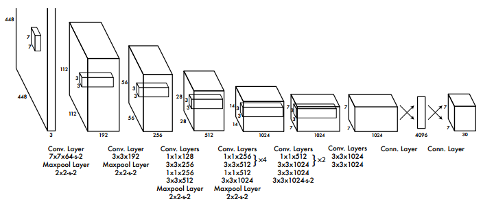
 ###### 그림 6 - Yolo_v1 Model Architecture

YOLO는 convolutional layer로 이미지로부터 특징을 추출하고, FC layer로 바운딩박스와 class 확률을 예측합니다.

YOLO는 24개의 convolutional layer와 2개의 fully connected layer로 이루어져 있습니다. 

그리고 Image classfication을 위한 GoogLeNet에서 영향을 받아 1x1 차원 감소 layer 뒤에 3x3 convolutional layer를 이용합니다.

Fast version YOLO의 경우 네트워크에서 convolutional layer의 수를 24개에서 9개로 줄이고, 적은 filter 수를 사용했다. 네트워크 구조 이외에 모든 parameter는 original YOLO와 같습니다.

네트워크의 최종 출력은 7x7x30 tensor 입니다. (VOC dataset에 맞춘 output 크기)

## Loss Function

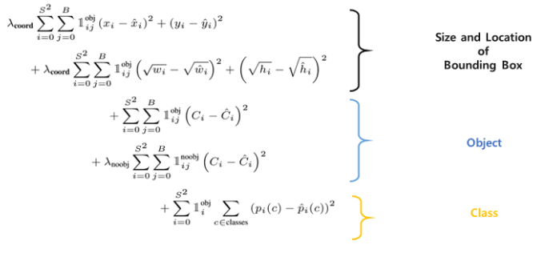
 ###### 그림 7 - Yolo_v1 Loss Function

YOLO는 sum-squared error 를 손실함수로 이용합니다. 이는 다음과 같은 이유로 모델의 불안정성을 발생시켜서 손실 함수를 수정해서 사용합니다.
   - [x] localization error와 classification error를 동등하게 가중치를 주는 것은 비이상적일 수 있습니다.
   - [x] 객체를 포함하고 있지 않은 grid cell은 confidence 값이 0을 갖습니다. 이는 객체를 포함한 grid cell의 gradient를 폭발하게 하고(객체를 포함한 confidence가 0을 향하게 하고) model이 불안정하게 만듭니다. 

이 문제를 해결하기 위해서 바운딩 박스의 좌표에 대한 손실을 증가시키고 객체를 포함하고 있지 않은 박스에 대한 confidence 손실을 감소시킵니다. 이를 실행하기 위해 두 가지 파라미터를 사용합니다.

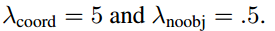
 
  > 1. λcoord는 바운딩 박스 좌표 손실에 대한 파라미터입니다. 바운딩 박스에 대한 손실을 5배 가중치로 두어 높은 패널티를 부여합니다. 
  > 2. λnoobj은 객체를 포함하고 있지 않은 박스에 대한 confidence 손실의 파라미터 입니다. 논문에서는 0.5로 설정했습니다. 즉, 배경인 경우 0.5의 가중치를 두어서 패널티를 낮추는 것입니다.

위 두 가지 파라미터로 localization error(바운딩 박스 좌표)와 classification error(잘못된 클래스 분류)에 가중치를 다르게 부여하게 됩니다.

- [x] x,y는 바운딩 박스 좌표입니다. 정답 좌표랑 예측 좌표 차이를 제곱하여 error를 계산하게 됩니다.
- [x] 1objij는 obj는 객체가 탐지된 바운딩 박스를 말합니다.(가장 높은 IOU를 갖고 있는 바운딩박스), 이 수식은 i번째 grid에서 j번째 객체를 포함한 바운딩박스를 의미합니다.
- [x] λcoord는 localization error의 페널티를 키우기 위한 파라미터로 5로 설정되어있습니다.
    - 즉, 객체를 포함한 바운딩박스의 좌표에는 5배의 페널티를 부과합니다.

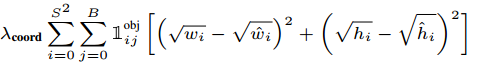

- [x] 바운딩 박스의 너비와 높이에 대한 error 입니다. 너비와 높이에도 5배의 페널티를 부여하는 것을 확인할 수 있습니다. 
- [x] 큰 박스에서 작은 변화와 작은 박스에서 작은 변화는 차이가 있습니다. 이를 보정해주기 위해 bounding box의 width와 height을 제곱근을 이용해 계산합니다.

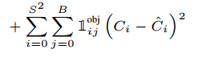

- [x] 객체를 포함한 바운딩 박스에 대한 confidence error 입니다.
- [x] Ci는 cell i에서 confidence score를 나타냅니다.  

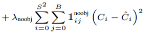

- [x] 객체를 포함하지 않은 바운딩박스에 대해 confidence error를 계산합니다. 
- [x] Ci는 cell i에서 confidence score를 나타냅니다.  

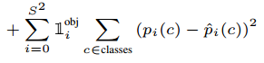

- [x] p(c) 클래스 확률에 대한 error입니다. 객체를 포함한 바운딩박스에 대해서만 계산합니다. 
    - classification error에 대한 부분으로 생각할 수 있습니다.

YOLO는 여러 개의 bounding boxes를 각각의 grid cell에서 예측합니다. 학습시에 각 grid cell마다 한 개의 bounding box를 원하기 때문에 bounding boxes 중에서 ground truth와 가장 IoU가 높은 box만 선택해서 학습을 시킵니다. 
    - 이때 선택된 한 개의 bounding box를 "responsible"이라 할당합니다.

## Model Training explained in the Paper
논문의 저자들은 다음과 같은 방법으로 모델을 학습시켰습니다.
  - Epoch = 135, batch size = 64, momentum = 0.9, decay = 0.0005
  - learning rate scheculing: 첫 epoch에서 10−3로 시작해서 75 epoch까지 10 −2으로 학습시킨다. 이후 30 epochs 동안 10 −3으로 학습하고, 마지막 30 epochs 동안 10−4으로 학습시킵니다.
  - overfitting을 막기 위해 dropout과 data augmentation을 활용했습니다.

학습을 마친 YOLO 모델은 PASCAL VOC의 이미지에 대해 각각 98개의 bounding boxes를 출력합니다. 이렇게 나온 98개의 bounding boxes들에 대해 NMS(Nom-Maximum Suprression)을 적용합니다.

# Pascal VOC Dataset

> ['Toilet', 'Swimming pool', 'Bed', 'Billiard table', 'Sink',
'Fountain', 'Oven', 'Ceiling fan', 'Television', 'Microwave oven',
'Gas stove', 'Refrigerator', 'Kitchen & dining room table', 'Washing machine', 'Bathtub',
'Stairs', 'Fireplace', 'Pillow', 'Mirror', 'Shower',
'Couch', 'Countertop', 'Coffeemaker', 'Dishwasher', 'Sofa bed',
'Tree house', 'Towel', 'Porch', 'Wine rack', 'Jacuzzi']

# Training

# Evaluation

# Future Work

# References

[1] 
